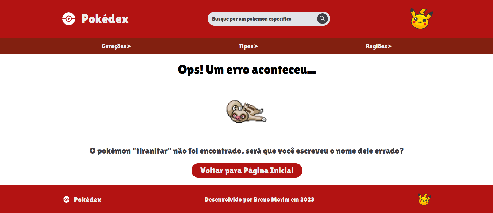

# Pokédex

Projeto em React-js que usa a PokeAPI para listar os Pokémons, permitindo buscas por tipo, nome, geração e entre outras funcionalidades.


## Detalhes do Projeto

O projeto usa a biblioteca axios para buscar as informações na PokeAPI, aplicando um cache com memoização para evitar fazer requisições desnecessárias. A biblioteca React foi usada para criar os componentes funcionais e reutilizáveis, usando dos hooks useEffect e useState para buscar os dados de forma assíncrona, contendo um componente de Carregando para dar feedback visual ao usuário em casos de demora nas requisições HTTP.

O site segue o padrão de SPA, usando a biblioteca react-router-dom, por padrão os componentes de cabeçalho, barra de navegação e rodápe são colocados em todas as páginas. O mesmo componente de Carregando que é usado para as listas de Pokémons é também usado como fallback nas rotas, em caso de demora no carregamento.

## Páginas

### Página Inicial - Banner do site e listas com os primeiros Pokémons de cada geração


### Página de Detalhes - Mostra os dados de um Pokémon específico, suas sprites, atributos, tipos, habilidades e Pokémons próximos na Pokédex


### Página de Erro - Usada como erro 404, quando Pokémon não é encontrado ou filtro não retorna resultado



### Filtro dos Pokémons por Geração


### Filtro dos Pokémons por Tipo


### Filtro dos Pokémons por Região


## Comandos para rodar o projeto na sua máquina

```sh
git clone https://github.com/BrenoMorim/pokedex.git pokedex
cd pokedex
npm install
npm start
```

---
